<div align="center">

</div>

<br />

<div align="center">

## ShopSmart – AI-Powered Full-Stack E-Commerce Platform  
**An Intelligent, End-to-End Shopping Experience for Modern Buyers and Sellers**

**Author:** Atharv Soni

</div>

---

### Overview

ShopSmart is an **AI-first, full-stack e-commerce platform** designed to deliver personalized, intelligent shopping experiences for shoppers, while empowering sellers and admins with automation, analytics, and operational insights. Built with a modern web stack and disciplined engineering practices, ShopSmart aims to feel like a **next-generation Shopify + Amazon hybrid**, infused with production-grade AI.

---

### Vision

**Build an AI-native commerce platform that understands intent, not just keywords.**

ShopSmart's core vision is to redefine digital commerce from static catalog browsing to a **conversational, adaptive, and deeply personalized experience**. Instead of forcing users to click through endless filters, ShopSmart uses **natural language, behavior data, and real-time AI models** to surface the right products, predict user needs, and protect the platform from fraud and spam.

---

### Objectives

- **AI-First Experience**
  - Deliver **natural-language search**, **AI recommendations**, and **smart assistance** embedded across the shopper journey.
- **Robust Full-Stack Architecture**
  - Implement a production-style stack with **React + shadcn/ui**, **Node.js + Express**, **Prisma ORM**, and **PostgreSQL or MongoDB**.
- **Prisma-Centric Data Layer**
  - Use **Prisma** as the single source of truth for schema, migrations, and type-safe access.
- **Secure Auth & Authorization**
  - Implement **JWT-based sessions** and **OAuth** (Google/GitHub/etc.) for frictionless login and role-based access (shopper/seller/admin).
- **AI API Integration**
  - Integrate **OpenAI or equivalent AI APIs** for search, recommendations, sentiment analysis, and fraud detection.
- **Modern UI & UX**
  - Leverage **shadcn/ui** for a polished, accessible, and consistent interface with a strong focus on usability.
- **Deployment & DevOps**
  - Deploy the **frontend on Vercel** and the **backend on Render**, with environment-specific configuration and secrets management.
- **Git Discipline**
  - Follow **trunk-based development**, conventional commits, standardized PR templates, and documentation-first design.

---

### Demo

> Planned demo of core user journeys (shopper, seller, admin) with AI features in action.

<video src="docs/demo.mp4" controls width="720"></video>

---

### Tech Stack

| Layer              | Technology             | Rationale                                           |
| ------------------ | ---------------------- | --------------------------------------------------- |
| **Frontend**       | React.js + shadcn/ui   | Modern, component-driven UI with consistent design  |
| **Backend**        | Node.js + Express      | Familiar, performant REST API server                |
| **ORM / Data**     | Prisma ORM             | Type-safe DB access, schema migrations, productivity |
| **Database**       | PostgreSQL or MongoDB  | Relational or document DB, depending on modeling    |
| **Auth**           | JWT + OAuth            | Secure sessions, social login integration           |
| **AI Services**    | OpenAI API             | Natural language processing, embeddings, generation |
| **Deployment**     | Vercel + Render       | Serverless frontend, managed backend hosting         |
| **Styling**        | Tailwind CSS           | Utility-first CSS framework                         |

---

### Features

#### Shopper Features

- **AI-Powered Natural Language Search**
  - Search using conversational queries like "comfortable running shoes under $100" instead of filters.
- **Intelligent Product Recommendations**
  - Personalized product suggestions based on browsing history, purchase patterns, and similar users.
- **Smart Shopping Cart**
  - Cart abandonment recovery, price drop alerts, and AI-suggested complementary items.
- **Wishlist & Collections**
  - Organize products into collections, share wishlists, and receive restock notifications.
- **Order Management**
  - Track orders, view history, reorder with one click, and manage returns/exchanges.
- **AI Shopping Assistant**
  - Chat-based assistant that helps find products, answers questions, and provides styling advice.

#### Seller Features

- **Comprehensive Dashboard**
  - Overview of sales, orders, inventory levels, and performance metrics at a glance.
- **Product Management**
  - Create, edit, and manage product listings with bulk operations and CSV import/export.
- **AI-Generated Product Descriptions**
  - Automatically generate SEO-optimized product descriptions, titles, and marketing copy.
- **Inventory Management**
  - Track stock levels, set low-stock alerts, and manage variants (size, color, etc.).
- **Sales Analytics**
  - Detailed reports on sales trends, top products, customer demographics, and revenue forecasting.
- **Order Fulfillment**
  - Process orders, print shipping labels, update tracking information, and manage returns.

#### Admin Features

- **User Management**
  - View, edit, suspend, or delete user accounts with role-based permissions.
- **Category & Taxonomy Management**
  - Create and organize product categories, tags, and attributes.
- **Platform Analytics**
  - System-wide metrics including total users, orders, revenue, and growth trends.
- **AI-Powered Fraud Detection**
  - Automated detection of suspicious accounts, fake reviews, and fraudulent transactions.
- **Content Moderation**
  - Review and moderate product listings, user reviews, and seller applications.
- **System Configuration**
  - Manage platform settings, payment gateways, shipping providers, and feature flags.

---

### AI Capabilities

#### Natural Language Search

- **Semantic Understanding**: Processes queries beyond keyword matching to understand intent and context.
- **Query Expansion**: Suggests related searches and automatically includes synonyms.
- **Conversational Interface**: Handles follow-up questions and refines results based on user feedback.

#### Recommendation Engine

- **Collaborative Filtering**: "Users who bought X also bought Y" recommendations.
- **Content-Based Filtering**: Suggestions based on product attributes and user preferences.
- **Hybrid Approach**: Combines multiple algorithms for optimal accuracy.
- **Real-Time Updates**: Recommendations adapt as users browse and interact.

#### Review Sentiment Analysis

- **Automated Sentiment Scoring**: Analyzes review text to determine positive, negative, or neutral sentiment.
- **Review Summarization**: Generates concise summaries of product reviews highlighting key points.
- **Spam Detection**: Identifies fake or spam reviews using pattern recognition and anomaly detection.

#### Fake/Spam Listing Detection

- **Pattern Recognition**: Detects suspicious product listings based on pricing, descriptions, and seller behavior.
- **Image Analysis**: Validates product images for authenticity and quality.
- **Automated Flagging**: Flags potential fraud for admin review before it impacts users.

#### Behavior-Based Personalization

- **Browsing History Analysis**: Tracks user behavior to understand preferences and interests.
- **Purchase Pattern Recognition**: Identifies buying habits and suggests relevant products.
- **Dynamic Homepage**: Customizes homepage content based on individual user preferences.
- **Personalized Email Campaigns**: Sends targeted product recommendations via email.

---

### Architecture

```mermaid
graph TD
    UI[React + shadcn/ui] --> API[Node.js API]
    API --> Prisma[Prisma ORM]
    Prisma --> DB[(Database)]
    API --> AI[AI APIs]
    AI --> API
    API --> UI
    
    UI --> Auth[JWT + OAuth]
    Auth --> API
    
    API --> Cache[Redis Cache]
    Cache --> DB
    
    style UI fill:#61dafb
    style API fill:#339933
    style Prisma fill:#2d3748
    style DB fill:#336791
    style AI fill:#ff6b6b
    style Auth fill:#4285f4
```



---

### Data Model (Prisma Schema Highlights)

```prisma
// User & Authentication
model User {
  id            String   @id @default(cuid())
  email         String   @unique
  name          String?
  role          Role     @default(SHOPPER)
  passwordHash  String?
  oauthProvider String?
  oauthId       String?
  createdAt     DateTime @default(now())
  updatedAt     DateTime @updatedAt
  
  orders        Order[]
  cartItems     CartItem[]
  wishlistItems WishlistItem[]
  reviews       Review[]
  addresses     Address[]
}

// Product Catalog
model Product {
  id          String   @id @default(cuid())
  name        String
  description String
  price       Decimal
  stock       Int
  images      String[]
  categoryId  String
  sellerId    String
  aiEmbedding Json?    // For semantic search
  createdAt   DateTime @default(now())
  updatedAt   DateTime @updatedAt
  
  category    Category @relation(fields: [categoryId], references: [id])
  seller      User     @relation(fields: [sellerId], references: [id])
  cartItems   CartItem[]
  orderItems  OrderItem[]
  wishlistItems WishlistItem[]
  reviews     Review[]
  variants    ProductVariant[]
}

// Shopping Cart
model CartItem {
  id        String   @id @default(cuid())
  userId    String
  productId String
  quantity  Int      @default(1)
  createdAt DateTime @default(now())
  
  user      User     @relation(fields: [userId], references: [id])
  product   Product  @relation(fields: [productId], references: [id])
}

// Orders
model Order {
  id          String      @id @default(cuid())
  userId      String
  status      OrderStatus @default(PENDING)
  total       Decimal
  shippingAddress Json
  paymentMethod String
  trackingNumber String?
  createdAt   DateTime @default(now())
  updatedAt   DateTime @updatedAt
  
  user        User       @relation(fields: [userId], references: [id])
  items       OrderItem[]
}

model OrderItem {
  id        String   @id @default(cuid())
  orderId   String
  productId String
  quantity  Int
  price     Decimal
  
  order     Order    @relation(fields: [orderId], references: [id])
  product   Product  @relation(fields: [productId], references: [id])
}

// Categories
model Category {
  id          String   @id @default(cuid())
  name        String
  slug        String   @unique
  description String?
  parentId    String?
  createdAt   DateTime @default(now())
  
  parent      Category? @relation("CategoryTree", fields: [parentId], references: [id])
  children    Category[] @relation("CategoryTree")
  products    Product[]
}

// Reviews
model Review {
  id        String   @id @default(cuid())
  userId    String
  productId String
  rating    Int
  title     String?
  content   String
  sentiment Float?   // AI-generated sentiment score
  verified  Boolean  @default(false)
  createdAt DateTime @default(now())
  
  user      User     @relation(fields: [userId], references: [id])
  product   Product  @relation(fields: [productId], references: [id])
}

// Wishlist
model WishlistItem {
  id        String   @id @default(cuid())
  userId    String
  productId String
  createdAt DateTime @default(now())
  
  user      User     @relation(fields: [userId], references: [id])
  product   Product  @relation(fields: [productId], references: [id])
}

// Addresses
model Address {
  id        String   @id @default(cuid())
  userId    String
  label     String
  street    String
  city      String
  state     String
  zipCode   String
  country   String
  isDefault Boolean  @default(false)
  createdAt DateTime @default(now())
  
  user      User     @relation(fields: [userId], references: [id])
}

enum Role {
  SHOPPER
  SELLER
  ADMIN
}

enum OrderStatus {
  PENDING
  CONFIRMED
  PROCESSING
  SHIPPED
  DELIVERED
  CANCELLED
  REFUNDED
}
```

---

### Development Roadmap

#### Phase 1: Foundation & Setup (Weeks 1-3)
- Initialize project structure (monorepo or separate repos)
- Set up Prisma schema with core models
- Configure database (PostgreSQL or MongoDB)
- Build Express API with basic CRUD endpoints
- Set up React frontend with Vite/Create React App
- Integrate shadcn/ui component library
- Implement JWT authentication and OAuth flow
- Deploy backend to Render and frontend to Vercel

#### Phase 2: Core Commerce Features (Weeks 4-7)
- Build product catalog with search and filtering
- Implement shopping cart functionality
- Create wishlist feature
- Develop order placement and management
- Build seller dashboard for product management
- Create admin panel for user and category management
- Add image upload and storage integration
- Implement basic payment processing (Stripe)

#### Phase 3: AI Integration (Weeks 8-11)
- Integrate OpenAI API for natural language search
- Build semantic search using embeddings
- Implement recommendation engine
- Add AI-generated product descriptions
- Create sentiment analysis for reviews
- Develop fraud detection algorithms
- Build AI shopping assistant chatbot
- Add behavior-based personalization

#### Phase 4: Polish & Optimization (Weeks 12-14)
- Optimize database queries and add caching (Redis)
- Implement comprehensive error handling
- Add loading states and skeleton screens
- Create responsive mobile design
- Write unit and integration tests
- Set up monitoring and logging
- Performance optimization and SEO improvements
- Documentation and deployment guides

---

### Documentation & Git Standards

#### Documentation

- **README.md**: Project overview, setup instructions, and quick start guide
- **API Documentation**: OpenAPI/Swagger specs for all endpoints
- **Component Documentation**: Storybook or similar for UI components
- **Database Schema**: Prisma schema documentation with relationships
- **Deployment Guide**: Step-by-step instructions for Vercel and Render
- **Contributing Guide**: Code style, PR process, and development workflow

#### Git Workflow

- **Branch Strategy**: Feature branches from `main`, PRs required for merge
- **Commit Messages**: Conventional commits format (`feat:`, `fix:`, `docs:`, `refactor:`, `test:`, `chore:`)
- **PR Template**: Includes description, type of change, testing checklist, and screenshots
- **Code Review**: At least one approval required before merging
- **Release Process**: Semantic versioning with tagged releases and changelog

#### Code Quality

- **Linting**: ESLint for JavaScript/TypeScript, Prettier for formatting
- **Type Safety**: TypeScript or PropTypes for React components
- **Testing**: Unit tests with Jest, integration tests for API endpoints
- **CI/CD**: Automated testing and deployment via GitHub Actions

---

### Conclusion

ShopSmart represents a **modern, AI-first approach to e-commerce** that prioritizes **user experience** and **intelligent automation**. By combining a robust full-stack architecture with cutting-edge AI capabilities, ShopSmart delivers a shopping experience that feels intuitive, personalized, and efficient.

The platform's **Prisma-centric data layer** ensures type safety and maintainability, its **shadcn/ui components** provide a polished user interface, and its **comprehensive AI integration** creates a competitive advantage in understanding and serving user needs. With a clear development roadmap and disciplined engineering practices, ShopSmart is positioned to become a leading platform in the next generation of e-commerce.

---

<div align="center">

**Built with ❤️ by Atharv Soni**

[Documentation](./docs) • [API Reference](./docs/api) • [Contributing](./CONTRIBUTING.md)

</div>
